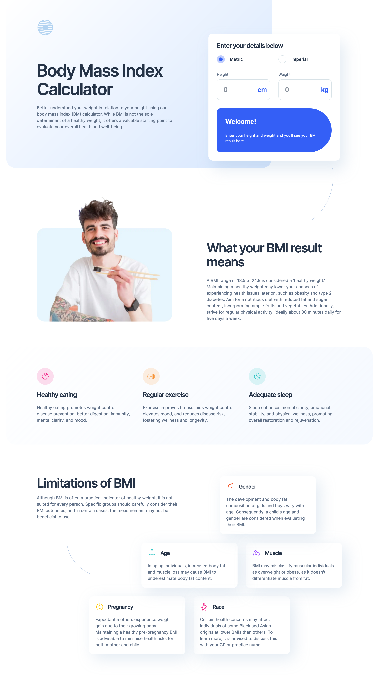

# Frontend Mentor - Body Mass Index Calculator solution

This is a solution to the [Body Mass Index Calculator challenge on Frontend Mentor](https://www.frontendmentor.io/challenges/body-mass-index-calculator-brrBkfSz1T).

## Table of contents

- [Frontend Mentor - Body Mass Index Calculator solution](#frontend-mentor---body-mass-index-calculator-solution)
  - [Table of contents](#table-of-contents)
  - [Overview](#overview)
    - [The challenge](#the-challenge)
    - [Screenshot](#screenshot)
    - [Links](#links)
  - [My process](#my-process)
    - [Built with](#built-with)
  - [Author](#author)

**Note: Delete this note and update the table of contents based on what sections you keep.**

## Overview

### The challenge

Users should be able to:

- Select whether they want to use metric or imperial units
- Enter their height and weight
- See their BMI result, with their weight classification and healthy weight range
- View the optimal layout for the interface depending on their device's screen size
- See hover and focus states for all interactive elements on the page

### Screenshot

### Links

- Source Code: [Github](https://github.com/mkokaras/bmi-calculator-challenge)
- URL: [Github Pages](https://mkokaras.github.io/bmi-calculator-challenge/)

## My process

### Built with

- Semantic HTML5 markup
- Sass
- Flexbox
- CSS Grid
- Vanilla Js
- Vanilla form input
- Mobile-first workflow

## Author

- Github - [Menelaos Kokaras](https://github.com/mkokaras)
- Frontend Mentor - [@mkokaras](https://www.frontendmentor.io/profile/mkokaras)
- Linkedin - [@menelaos-kokaras](www.linkedin.com/in/menelaos-kokaras-9a6618235)
